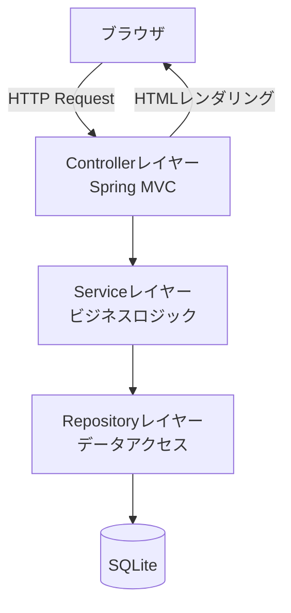
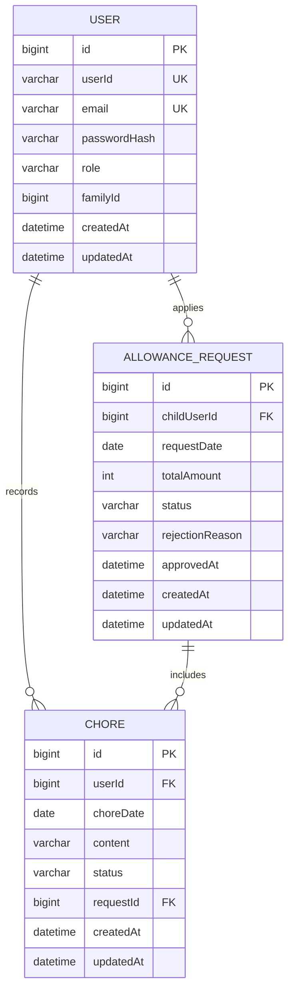
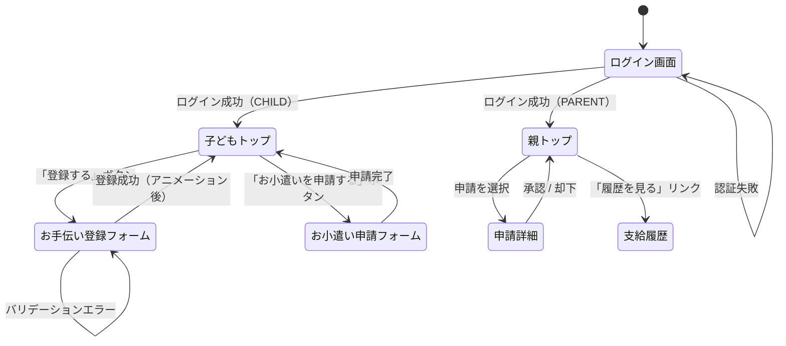
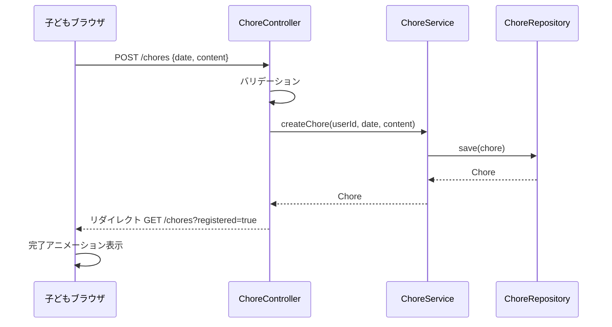
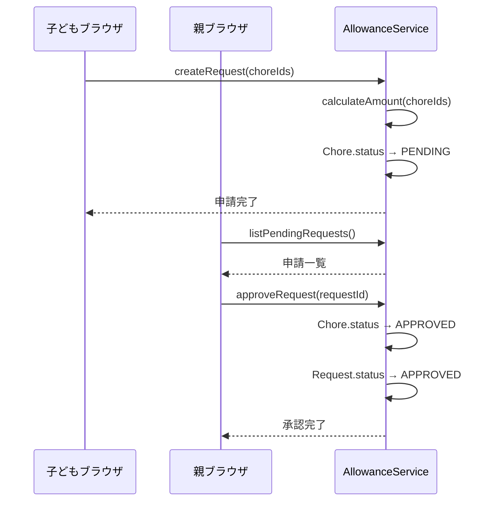

# 機能設計書 (Functional Design Document)

## システム構成図



## 技術スタック

| 分類 | 技術 | 選定理由 |
|------|------|----------|
| 言語 | Java 25 | プロジェクト標準 |
| フレームワーク | Spring Boot 4.0.6 | MVCパターン、DI、セキュリティ機能が揃っている |
| テンプレートエンジン | Thymeleaf | Spring Bootとの統合が容易、サーバーサイドレンダリング |
| データベース | SQLite | 家族単位の小規模利用に適した軽量DB |
| ビルドツール | Maven | プロジェクト標準 |

---

## データモデル定義

### エンティティ: User（ユーザー）

```java
class User {
    Long id;           // PK
    String userId;     // ログイン用ユーザーID（一意）
    String email;      // メールアドレス（一意、任意）
    String passwordHash; // BCryptハッシュ
    Role role;         // PARENT | CHILD
    Long familyId;     // 将来のマルチファミリー対応用
    LocalDateTime createdAt;
    LocalDateTime updatedAt;
}

enum Role { PARENT, CHILD }
```

**制約**:
- `userId` はシステム全体で一意
- `email` はnull許容（子どもアカウントは省略可）、設定する場合は一意
- `userId` と `email` のどちらか一方でログイン可能
- `passwordHash` はBCryptでハッシュ化

---

### エンティティ: Chore（お手伝い）

```java
class Chore {
    Long id;              // PK
    Long userId;          // FK → User（記録した子ども）
    LocalDate choreDate;  // お手伝いを行った日付
    String content;       // お手伝い内容（自由テキスト）
    ChoreStatus status;   // UNPAID | PENDING | APPROVED | REJECTED
    Long requestId;       // FK → AllowanceRequest（null = 未申請）
    LocalDateTime createdAt;
    LocalDateTime updatedAt;
}

enum ChoreStatus { UNPAID, PENDING, APPROVED, REJECTED }
```

**制約**:
- `choreDate` は未来日不可
- `content` は1〜100文字
- `status = UNPAID` のときのみ削除可能
- `status = REJECTED` のとき `requestId` をnullに戻して `UNPAID` に変更する

---

### エンティティ: AllowanceRequest（お小遣い申請）

```java
class AllowanceRequest {
    Long id;               // PK
    Long childUserId;      // FK → User（申請した子ども）
    LocalDate requestDate; // 申請日
    Integer totalAmount;   // 申請金額（円）
    RequestStatus status;  // PENDING | APPROVED | REJECTED
    String rejectionReason; // 却下理由（任意）
    LocalDateTime approvedAt; // 承認日時（null = 未承認）
    LocalDateTime createdAt;
    LocalDateTime updatedAt;
}

enum RequestStatus { PENDING, APPROVED, REJECTED }
```

**制約**:
- `totalAmount` はリクエスト作成時に計算してDBに保存する
- 承認後の `totalAmount` は変更不可
- `rejectionReason` は却下時のみ設定

---

### ER図



---

## お小遣い計算アルゴリズム

**目的**: 選択されたお手伝いの一覧から申請金額を計算する

**計算ロジック**:

1. 対象のお手伝いを `choreDate` でグループ化する
2. 各日付のお手伝い回数に応じて金額を算出する
3. 全日付の金額を合計する

```
1日のお手伝い回数 n に対する金額:
- n = 1: ¥20
- n = 2: ¥50
- n ≥ 3: ¥50 × (n - 1)
```

**実装例（Java）**:

```java
int calculateAmount(List<Chore> chores) {
    Map<LocalDate, Long> countByDate = chores.stream()
        .collect(Collectors.groupingBy(Chore::getChoreDate, Collectors.counting()));

    return countByDate.values().stream()
        .mapToInt(n -> {
            if (n == 1) return 20;
            if (n == 2) return 50;
            return 50 * (int)(n - 1);  // n >= 3
        })
        .sum();
}
```

---

## コンポーネント設計

### Controllerレイヤー

**責務**: HTTPリクエストの受付・バリデーション・Thymeleafテンプレートへのデータ渡し

```java
// AuthController
class AuthController {
    GET  /login          → ログインページ表示
    POST /login          → 認証処理（成功→ロール別トップ画面、失敗→ログインページ）
    POST /logout         → セッション破棄→ログインページ
}

// ChoreController（CHILD権限）
class ChoreController {
    GET  /chores         → お手伝い一覧ページ（未申請・申請中・承認済み）
    GET  /chores/new     → お手伝い登録フォーム
    POST /chores         → お手伝い登録（成功→アニメーション→一覧）
    POST /chores/{id}/delete → お手伝い削除（UNPAID状態のみ）
}

// RequestController（CHILD権限）
class RequestController {
    GET  /requests/new   → お小遣い申請フォーム（未申請お手伝い選択 + 金額プレビュー）
    POST /requests/preview → 選択した金額をAJAXで計算して返す
    POST /requests       → 申請確定
}

// ApprovalController（PARENT権限）
class ApprovalController {
    GET  /approvals          → 申請一覧ページ（PENDING）
    GET  /approvals/{id}     → 申請詳細（お手伝い明細付き）
    POST /approvals/{id}/approve → 承認処理
    POST /approvals/{id}/reject  → 却下処理
    GET  /history            → 承認済み支給履歴一覧
}
```

### Serviceレイヤー

**責務**: ビジネスロジックの実装・トランザクション管理

```java
class ChoreService {
    createChore(Long userId, LocalDate date, String content): Chore
    deleteChore(Long choreId, Long userId): void  // UNPAID確認
    listChores(Long userId): List<Chore>
    listUnpaidChores(Long userId): List<Chore>
}

class AllowanceService {
    calculateAmount(List<Long> choreIds): int
    createRequest(Long childUserId, List<Long> choreIds): AllowanceRequest
    approveRequest(Long requestId): void          // Chore.statusをAPPROVEDに
    rejectRequest(Long requestId, String reason): void  // Chore.statusをUNPAIDに戻す
    listPendingRequests(): List<AllowanceRequest>
    listApprovedHistory(): List<AllowanceRequest>
}

class AuthService {
    authenticate(String loginId, String password): User  // userId or email
    loadUserByLoginId(String loginId): UserDetails
}
```

### Repositoryレイヤー

**責務**: SQLiteへのCRUD操作

```java
interface UserRepository extends JpaRepository<User, Long> {
    Optional<User> findByUserId(String userId);
    Optional<User> findByEmail(String email);
    Optional<User> findByUserIdOrEmail(String userId, String email);
}

interface ChoreRepository extends JpaRepository<Chore, Long> {
    List<Chore> findByUserIdOrderByChoreDate(Long userId);
    List<Chore> findByUserIdAndStatus(Long userId, ChoreStatus status);
    List<Chore> findByIdInAndStatus(List<Long> ids, ChoreStatus status);
}

interface AllowanceRequestRepository extends JpaRepository<AllowanceRequest, Long> {
    List<AllowanceRequest> findByStatusOrderByCreatedAtDesc(RequestStatus status);
    List<AllowanceRequest> findByChildUserIdAndStatus(Long childUserId, RequestStatus status);
}
```

---

## 画面遷移図



---

## ユースケースフロー

### お手伝い登録



### お小遣い申請〜承認



---

## UI設計

### 画面一覧

| 画面 | URL | ロール |
|------|-----|-------|
| ログイン | /login | 全員 |
| お手伝い一覧（子どもトップ） | /chores | CHILD |
| お手伝い登録 | /chores/new | CHILD |
| お小遣い申請 | /requests/new | CHILD |
| 申請一覧（親トップ） | /approvals | PARENT |
| 申請詳細・承認 | /approvals/{id} | PARENT |
| 支給履歴 | /history | PARENT |

### 登録完了アニメーション

- お手伝い登録完了時（GET /chores?registered=true）に画面上部にアニメーションバナーを表示
- CSS animation（fadeIn + sparkle）で実装、3秒後に自動消滅
- 「今日もお手伝いありがとう！」などの子ども向けメッセージを表示

---

## セキュリティ設計

| 観点 | 対策 |
|------|------|
| 認証 | Spring Security のフォーム認証 + セッション管理 |
| パスワード | BCryptでハッシュ化（strength=12） |
| ロール制御 | `@PreAuthorize` でエンドポイントごとに PARENT/CHILD を制限 |
| CSRF | Spring Security の CSRF トークンをThymeleafフォームに自動付与 |
| 入力検証 | Bean Validation（`@NotBlank`, `@Size`, `@PastOrPresent`等） |
| 他ユーザーデータアクセス | ServiceレイヤーでuserId一致を確認してから操作 |

---

## エラーハンドリング

| エラー種別 | 処理 | ユーザーへの表示 |
|-----------|------|-----------------|
| ログイン失敗 | 認証エラー | 「ユーザーIDまたはパスワードが違います」 |
| バリデーションエラー | フォームに戻る | フィールドごとのエラーメッセージ |
| UNPAID以外のお手伝いを削除 | 403を返す | 「申請中または承認済みのお手伝いは削除できません」 |
| 他ユーザーのリソースへのアクセス | 403を返す | 「アクセス権限がありません」 |
| DBエラー | トランザクションロールバック | 「エラーが発生しました。もう一度お試しください」 |

---

## テスト戦略

### ユニットテスト

- `AllowanceService.calculateAmount()` — 境界値（1回/2回/3回/複数日）の計算が正しいか
- `ChoreService.deleteChore()` — UNPAID以外で例外が投げられるか
- `AuthService.authenticate()` — userId・email 両方でログインできるか

### 統合テスト

- お手伝い登録 → お小遣い申請 → 承認 の一連フローが正しくステータス遷移するか
- 却下後にお手伝いが UNPAID に戻るか

### E2Eテスト

- 子どもが登録→申請→完了アニメーション確認のシナリオ
- 親が申請一覧確認→承認→履歴に記録されるシナリオ
