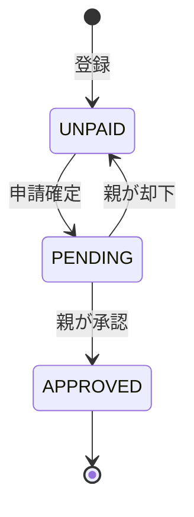

# プロジェクト用語集 (Glossary)

## 概要

このドキュメントは、「お手伝いポイント管理アプリ」プロジェクト内で使用される用語の定義を管理します。

**更新日**: 2026-05-16

---

## ドメイン用語

### お手伝い

**定義**: 子どもが家庭内で行う家事や手伝いの1件のこと。

**説明**: 日付とお手伝い内容（自由テキスト）で構成される。子どもが自らブラウザから登録する。登録後は未申請・申請中・承認済み・却下のいずれかの状態を持つ。

**関連用語**: お手伝いステータス、お小遣い申請

**使用例**:
- 「今日のお手伝い（食器洗い）を登録する」
- 「未申請のお手伝いが3件あります」

**英語表記**: Chore

---

### お小遣い申請

**定義**: 子どもが未払いのお手伝い実績をまとめて親に申請する行為、およびその申請データ。

**説明**: 複数日分のお手伝いを一括で選択して申請できる。申請時に計算されたお小遣い金額を含む。申請後は親による承認または却下を待つ状態（申請中）になる。

**関連用語**: お手伝い、お小遣い計算ルール、親による承認

**使用例**:
- 「今週分のお手伝いをまとめてお小遣い申請する」
- 「申請中の件数：2件」

**英語表記**: AllowanceRequest

---

### お小遣い計算ルール

**定義**: 1日あたりのお手伝い回数に応じてお小遣い金額を算出するルール。

**説明**: 1日単位で集計し、全日付の合計金額を申請金額とする。

| 1日のお手伝い回数 | 金額 |
|---|---|
| 1回 | ¥20 |
| 2回 | ¥50 |
| n回（n≥3） | ¥50 × (n − 1) |

**関連用語**: お小遣い申請

**使用例**:
- 「5月1日: 1回(¥20) + 5月2日: 3回(¥100) → 申請金額 ¥120」

---

### 親による承認

**定義**: 親ロールのユーザーが子どものお小遣い申請を確認し、支給を決定する操作。

**説明**: 承認するとお手伝いのステータスが「承認済み」になり、支給履歴に記録される。却下するとお手伝いが「未申請」状態に戻り、子どもが再申請できる。

**関連用語**: お小遣い申請、支給履歴

**英語表記**: Approval

---

### 支給履歴

**定義**: 親が承認したお小遣い申請の記録一覧。

**説明**: 承認日・申請金額・対象のお手伝い一覧を含む。親が過去の支給実績を振り返るために使用する。

**関連用語**: お小遣い申請、親による承認

**英語表記**: Payment History

---

### 親ロール

**定義**: お小遣い申請の確認・承認・却下・支給履歴の閲覧が可能なユーザー種別。

**説明**: Spring Security の `ROLE_PARENT` に対応する。子どもロールより広い機能権限を持つ。

**関連用語**: 子どもロール、ロール

**英語表記**: PARENT Role

---

### 子どもロール

**定義**: お手伝いの登録・削除・お小遣い申請のみ操作可能なユーザー種別。

**説明**: Spring Security の `ROLE_CHILD` に対応する。親による承認・支給履歴の参照はできない。

**関連用語**: 親ロール、ロール

**英語表記**: CHILD Role

---

### ユーザーID

**定義**: ログイン時に使用するシステム上の一意な識別子（文字列）。

**説明**: メールアドレスを持たない子どもアカウントでも使用できるログインIDとして導入。メールアドレスと同様にログイン認証に使用できる。システム全体で一意。

**関連用語**: メールアドレス、ログイン

**英語表記**: userId

---

## ステータス・状態

### お手伝いステータス（ChoreStatus）

| ステータス | 日本語 | 意味 | 遷移条件 |
|-----------|--------|------|---------|
| `UNPAID` | 未申請 | 登録済みだが申請していない | 初期状態 / 申請が却下されて戻った状態 |
| `PENDING` | 申請中 | お小遣い申請中で親の承認待ち | 子どもがお小遣い申請を確定 |
| `APPROVED` | 承認済み | 親が承認し支給済み | 親が申請を承認 |
| `REJECTED` | 却下 | 親が申請を却下（→UNPAIDへ戻る） | 親が申請を却下（即座にUNPAIDへ） |

**状態遷移図**:


---

### 申請ステータス（RequestStatus）

| ステータス | 日本語 | 意味 |
|-----------|--------|------|
| `PENDING` | 申請中 | 親の承認待ち |
| `APPROVED` | 承認済み | 親が承認し支給済み |
| `REJECTED` | 却下 | 親が却下（対象お手伝いはUNPAIDに戻る） |

---

## データモデル用語

### User（ユーザー）

**定義**: システムを利用する家族メンバーのアカウント情報を管理するエンティティ。

**主要フィールド**:
- `userId`: ログイン用ユーザーID（一意、必須）
- `email`: メールアドレス（一意、任意 — 子どもアカウントは省略可）
- `passwordHash`: BCryptハッシュ化済みパスワード
- `role`: ロール（`PARENT` または `CHILD`）
- `familyId`: 家族グループID（将来のマルチファミリー対応用）

**関連エンティティ**: Chore、AllowanceRequest

---

### Chore（お手伝い）

**定義**: 子どもが行ったお手伝いの1件を管理するエンティティ。

**主要フィールド**:
- `userId`: 記録した子どものID（FK → User）
- `choreDate`: お手伝いを行った日付
- `content`: お手伝い内容（自由テキスト、100文字以内）
- `status`: お手伝いステータス（ChoreStatus）
- `requestId`: 紐づく申請ID（FK → AllowanceRequest、未申請の場合null）

**関連エンティティ**: User、AllowanceRequest

---

### AllowanceRequest（お小遣い申請）

**定義**: 子どもが行ったお小遣い申請の1件を管理するエンティティ。複数のChoreをまとめる。

**主要フィールド**:
- `childUserId`: 申請した子どものID（FK → User）
- `requestDate`: 申請日
- `totalAmount`: 申請金額（円）— 申請確定時に計算・保存
- `status`: 申請ステータス（RequestStatus）
- `rejectionReason`: 却下理由（任意）

**関連エンティティ**: User、Chore

---

## 技術用語

### Spring Boot

**定義**: Java向けのWebアプリケーションフレームワーク。

**本プロジェクトでの用途**: HTTPリクエストの受付・サービス層・データ永続化・認証の全体基盤として使用。

**バージョン**: 4.0.6

**関連ドキュメント**: `docs/architecture.md`

---

### Thymeleaf

**定義**: Spring Bootと統合されたサーバーサイドHTMLテンプレートエンジン。

**本プロジェクトでの用途**: 全画面のHTMLテンプレート（ログイン・一覧・フォーム・承認等）のレンダリング。SPAは使用せずサーバーサイドレンダリングで完結。

**バージョン**: Spring Boot 4.0.6 同梱版

---

### Spring Security

**定義**: Spring BootのWebセキュリティフレームワーク。認証・認可・CSRF対策を提供。

**本プロジェクトでの用途**: フォーム認証（ユーザーID/メール + パスワード）、ROLE_PARENT/ROLE_CHILDによるURLアクセス制御、CSRFトークン自動付与。

---

### SQLite

**定義**: ファイルベースの軽量リレーショナルデータベース。サーバープロセス不要。

**本プロジェクトでの用途**: 全データの永続化。家族単位の小規模利用に適しており、追加インフラ不要で起動できる。

**バージョン**: 3.x（JDBC経由）

**関連ドキュメント**: `docs/architecture.md`

---

### Spring Data JPA

**定義**: JPA（Java Persistence API）をSpring向けに簡略化したデータアクセス層フレームワーク。

**本プロジェクトでの用途**: `ChoreRepository`、`UserRepository`、`AllowanceRequestRepository` の実装基盤。リポジトリインターフェースを宣言するだけでCRUDが自動生成される。

---

### Bean Validation

**定義**: Javaの入力検証標準仕様。`@NotBlank`、`@Size`、`@PastOrPresent` 等のアノテーションで検証ルールを定義する。

**本プロジェクトでの用途**: フォームDTOクラス（`ChoreForm`、`RequestForm`等）の入力検証。Controller で `@Valid` を付与することで自動検証が走る。

---

## 略語・頭字語

### PRD

**正式名称**: Product Requirements Document

**意味**: プロダクト要求定義書。プロダクトの目的・ユーザー・機能要件・非機能要件を定義するドキュメント。

**本プロジェクトでの使用**: `docs/product-requirements.md`

---

### JPA

**正式名称**: Jakarta Persistence API（旧: Java Persistence API）

**意味**: JavaオブジェクトとRDBのテーブルをマッピングするための標準API仕様。

**本プロジェクトでの使用**: エンティティクラス（`@Entity`）とリポジトリインターフェース（`JpaRepository`）

---

### DTO

**正式名称**: Data Transfer Object

**意味**: レイヤー間でデータを受け渡すための専用クラス。

**本プロジェクトでの使用**: Controller と Service 間のフォームデータ受け渡し（`ChoreForm`, `RequestForm`, `ApprovalForm`）

---

### CSRF

**正式名称**: Cross-Site Request Forgery

**意味**: 悪意あるサイトからの不正リクエストを送りつける攻撃手法。

**本プロジェクトでの使用**: Spring Security のCSRF保護を有効化し、Thymeleafフォームに自動的にCSRFトークンを付与することで対策済み。

---

## アーキテクチャ用語

### レイヤードアーキテクチャ

**定義**: システムをPresentation・Service・Repository・DB の階層に分割し、上位から下位への一方向の依存関係のみを許容するアーキテクチャパターン。

**本プロジェクトでの適用**:
```
Controller（Presentation）
    ↓
Service（ビジネスロジック）
    ↓
Repository（データアクセス）
    ↓
SQLite
```

**関連コンポーネント**: `controller/`, `service/`, `repository/`

**関連ドキュメント**: `docs/architecture.md`, `docs/repository-structure.md`

---

### ロールベースアクセス制御

**定義**: ユーザーに割り当てられたロール（役割）に基づいてシステム機能へのアクセスを制限する仕組み。

**本プロジェクトでの適用**: `ROLE_PARENT` は全機能にアクセス可、`ROLE_CHILD` はお手伝い登録・申請のみアクセス可。URLパスごとに Spring Security で制御。

**英語表記**: RBAC（Role-Based Access Control）
